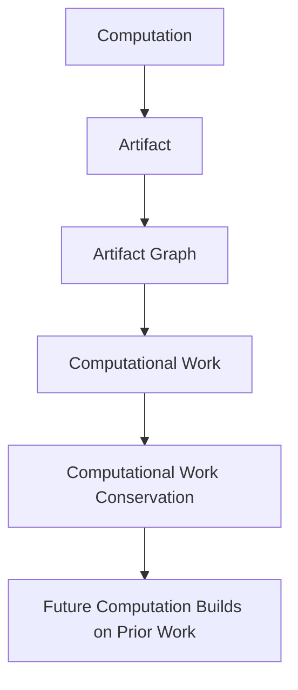

# Agent Artifact Availability (AAA)

Modern computing infrastructure preserves **data**.

Autonomous computational systems must preserve **computational work**.

The **Agent Artifact Availability (AAA)** framework proposes infrastructure that allows computational systems to **accumulate work over time rather than repeatedly recomputing it.**

Although motivated by autonomous agent ecosystems, AAA applies to any computational system that repeatedly recomputes work: build systems, data pipelines, scientific workflows, and AI systems.

---

## The Transformation

Without artifact availability, computational work evaporates.

    Without AAA                    With AAA

    compute → ✗                    compute → ◆
    compute → ✗                    compute → ◆ → ◆
    compute → ✗                    compute → ◆ → ◆ → ◆

    Work evaporates.               Work accumulates.

---

## The Core Insight

Computational systems continuously produce artifacts representing completed work.

Artifacts depend on other artifacts, forming **artifact graphs**.

If artifacts persist, the work they represent persists.

If artifacts disappear, the work must be performed again.

AAA proposes infrastructure that preserves artifacts so **computational work can accumulate.**

---

## AAA in One Diagram

AAA allows computational systems to accumulate work instead of repeatedly recomputing it.

---

## Primitives

The framework is built from a small set of named concepts.

**Primitives**
- **Artifact** — the durable output of a completed computational process
- **Artifact Graph** — the directed graph of artifacts and their derivation relationships
- **Artifact Identity** — a stable identifier derived from the computation and inputs that produced an artifact
- **Artifact Availability** — the property that artifacts remain retrievable, verifiable, and reusable across agents, workflows, and time

**Derived Concept**
- **Computational Work** — the accumulated structure of computation encoded in an artifact graph

**System Principle**
- **Computational Work Conservation** — completed computational work persists only through the artifacts produced by that work

---

## The Four Conceptual Moves

The AAA framework unfolds through four ideas.

**1. Artifacts represent computational work**

Artifacts are durable outputs of computation. Each artifact encapsulates the work required to produce it.

**2. Computational work has graph structure**

Artifacts depend on prior artifacts, forming artifact graphs that encode computational workflows and dependencies.

**3. Current systems destroy this structure**

Existing infrastructure preserves data, but not the artifact graphs representing work. As a result, computational work is frequently lost and recomputed.

**4. AAA preserves computational work**

The Artifact Availability Layer preserves artifact graphs and enables systems to accumulate computational work over time.

---

## The Artifact Availability Layer

AAA introduces a new infrastructure layer between compute and storage.

    Traditional Stack           AAA Stack

    Applications                Applications
         ↓                           ↓
      Compute                     Compute
         ↓                           ↓
      Storage               Artifact Availability Layer
                                      ↓
                                   Storage

The Artifact Availability Layer manages artifact identity, discovery, graph preservation, and availability.

---

## AAA Properties

A system satisfies AAA when artifacts remain:

- **Retrievable** — accessible through a stable identifier independent of the producing environment
- **Verifiable** — validatable as identical to the original computational output
- **Reusable** — consumable by other agents or workflows without recomputation
- **Persistent** — available even when the originating process is no longer active

These properties for artifact systems are analogous to ACID properties for database transactions: a named set of formal requirements any conforming implementation must satisfy.

---

## Cumulative Computing

AAA enables a new computational paradigm: systems that accumulate work.

    Traditional computing:    compute → result → forget

    AAA computing:            compute → artifact → build on artifact

Instead of repeatedly recomputing results, systems can extend prior computation.

---

## Human Knowledge Systems

Human knowledge systems already operate this way.

- **Libraries** — artifact availability for human knowledge
- **Citation networks** — artifact graphs
- **Peer review** — artifact verification
- **Science** — cumulative knowledge

Science and engineering advance because prior work remains available and composable.

AAA proposes the same infrastructure for machine computation.

---

## The Paper Series

The seven notes develop the AAA framework as a conceptual ladder.

    Observation → Object Model → Structural Model → System Failure →
    Architecture → Mechanism → Principle

| Note | Title |
|---|---|
| [01](01_agent_artifact_availability.md) | Agent Artifact Availability |
| [02](02_artifacts_as_units_of_computational_work.md) | Artifacts as Units of Computational Work |
| [03](03_artifact_graphs.md) | Artifact Graphs |
| [04](04_why_storage_systems_lose_computational_work.md) | Why Storage Systems Lose Computational Work |
| [05](05_artifact_availability_layer.md) | The Artifact Availability Layer |
| [06](06_deterministic_artifact_identity.md) | Deterministic Artifact Identity |
| [07](07_computational_work_conservation.md) | Computational Work Conservation |

---

Traditional infrastructure preserves data.

AAA infrastructure preserves computational work.

When artifacts remain available, computational systems can build upon prior computation rather than repeating it.

---

## Further Reading

The broader paradigm emerging from this series is explored in [Cumulative Computing](cumulative_computing.md).

---

**Author:** Rich Kopcho
**Series:** Agent Artifact Availability (AAA)
**Date:** March 2026

Released under [CC BY 4.0](https://creativecommons.org/licenses/by/4.0/)
